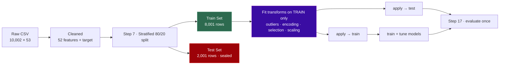

# Text ML Pipeline — Flow & Step-by-Step Guide

Flow for **`text-ml-pipeline.ipynb`** — screens text for mental health profiles. It trains an
**Extra Trees** classifier reaching **99.15% test accuracy** across **6 classes**
(ANXIETY, BIPOLAR, DEPRESSION, NORMAL, STRESS, SUICIDAL) from **20** selected
linguistic/semantic features (out of 52).

> Mermaid note: line breaks inside nodes use ` ` so the diagram renders on GitHub and in
> the VS Code Markdown preview. (Literal `\n` does not render and shows as raw text.)

The notebook has **20 steps (Step 0 – Step 19)**. The numbering below matches the notebook cells
exactly.

---

## 1. End-to-End Flow

```mermaid
flowchart TD
    S0["Step 0 · Imports & Hardware Detection<br/>libraries · CPU cores · GPU/CUDA"]
    S1["Step 1 · Configuration<br/>FILE_PATH · TASK_TYPE · seed=42 · OUTPUT_DIR"]
    S2["Step 2 · Data Loading<br/>read CSV → df (+ untouched df_raw)"]
    S3["Step 3 · Column Overview & Optional Drop<br/>per-column summary · COLUMNS_TO_DROP (empty by default)"]
    S4["Step 4 · Target Selection<br/>TARGET_COLUMN = mental_health_label · validate"]
    S5["Step 5 · Data Profiling & Quality Audit<br/>nulls · duplicates · constants · ID-like · leakage (diagnostic)"]
    S6["Step 6 · Auto-Clean<br/>drop flagged cols · impute · drop duplicate rows"]

    SPLIT{{"Step 7 · Target Analysis & Train/Test Split<br/>class balance → stratified 80/20<br/>8,001 train / 2,001 test · ANTI-LEAKAGE BOUNDARY"}}

    subgraph FIT["Train-fit transforms — fit on TRAIN only, apply to both"]
        direction TB
        S8["Step 8 · Outlier Handling (smoothing only)<br/>per-column lowest-skew transform · never drops rows"]
        S9["Step 9 · Feature Type Handling<br/>encode categoricals by cardinality"]
        S10["Step 10 · EDA & Visualization<br/>distributions · correlations · Kruskal-Wallis · Levene (train only)"]
        S11["Step 11 · Feature Selection (multi-method)<br/>correlation → VIF → RF + MI + stat-test consensus<br/>52 → 20 features"]
        S12["Step 12 · Feature Scaling<br/>RobustScaler"]
        S8 --> S9 --> S10 --> S11 --> S12
    end

    subgraph MODEL["Model search & tuning — train only"]
        direction TB
        S13["Step 13 · Model Shortlisting<br/>dynamic, hardware-aware (up to 8 models)"]
        S14["Step 14 · Training & CV Ranking<br/>5-fold stratified · F1 macro"]
        S15["Step 15 · Top-K Selection<br/>keep top 2 by CV score"]
        S16["Step 16 · Hyperparameter Tuning<br/>Optuna TPE · 5-fold CV per trial"]
        S13 --> S14 --> S15 --> S16
    end

    subgraph DELIVER["Evaluate & deliver"]
        direction TB
        S17["Step 17 · Final Evaluation on Test<br/>Accuracy 99.15% · F1 0.9915<br/>raw + normalized confusion matrix"]
        S18["Step 18 · Save All Artifacts<br/>model · scaler · encoders · transformers · feature_names · metadata"]
        S19["Step 19 · Explainability (SHAP)<br/>global · per-class · waterfall PNGs"]
        S17 --> S18 --> S19
    end

    S0 --> S1 --> S2 --> S3 --> S4 --> S5 --> S6 --> SPLIT
    SPLIT -->|"Train 8,001 rows"| FIT
    FIT --> MODEL --> DELIVER
    SPLIT -.->|"Test 2,001 rows held out"| S17

    style SPLIT fill:#533483,stroke:#e94560,color:#fff
    style FIT fill:#0f3460,stroke:#53a8b6,color:#fff
    style MODEL fill:#6a040f,stroke:#d00000,color:#fff
    style DELIVER fill:#2d6a4f,stroke:#40916c,color:#fff
```

---

## 2. Anti-Leakage Design (why the split is the boundary)

Everything that *learns* from data (outlier parameters, encoders, the selected feature list, the
scaler) is fit **only on the training set**, then applied unchanged to the test set. The test
set is untouched until Step 17 — which is what makes the 99.15% number honest rather than
inflated by leakage.

---

## Step-by-Step — What Happens & Why

### Step 0 — Import Libraries & Hardware Detection
**What:** Imports every library used in the run and detects CPU core count and GPU/CUDA
availability.
**Why:** Importing up front makes the notebook fail fast if a dependency is missing (instead of
mid-run). Detecting hardware lets later steps switch XGBoost/LightGBM to GPU automatically.

### Step 1 — Configuration
**What:** Sets the user-editable settings: `FILE_PATH`, `TASK_TYPE` (locked to
`'classification'`), `RANDOM_SEED = 42`, and `OUTPUT_DIR`.
**Why:** One place controls the whole run, and a fixed seed makes the split, training, and Optuna
tuning reproducible across runs.

### Step 2 — Data Loading
**What:** Reads the CSV into `df` and keeps an untouched copy as `df_raw`; prints shape/dtypes.
**Why:** Validating the load immediately catches a wrong path or malformed file. `df_raw` is a
safety net so the original data is always recoverable.

### Step 3 — Column Overview & Optional Column Deletion
**What:** Prints a per-column summary (dtype, nulls, unique count, sample) and optionally drops
columns in `COLUMNS_TO_DROP` (empty by default).
**Why:** Lets you see exactly what's in the data and remove obvious non-features (IDs, metadata)
before they affect profiling or selection.

### Step 4 — Target Column Selection
**What:** Sets `TARGET_COLUMN = 'mental_health_label'` and validates it exists; prints the class
names.
**Why:** Everything downstream separates features from this target. Validating up front turns a
silent wrong-column bug into an immediate, clear error.

### Step 5 — Data Profiling & Quality Audit
**What:** Scans every column for six issue types — high nulls, duplicate rows, constant columns,
ID-like columns, high-cardinality categoricals, and target leakage. Diagnostic only.
**Why:** Cleaning should be evidence-driven. Separating "diagnose" (Step 5) from "fix" (Step 6)
keeps the actual changes conservative and auditable. Leakage detection is especially important —
a column that maps 1-to-1 to the label would let the model cheat.

### Step 6 — Auto-Clean
**What:** Drops the columns flagged in Step 5, imputes remaining nulls, and removes duplicate
rows.
**Why:** These fixes are safe and necessary: constant/leaky columns mislead the model, nulls
break many estimators, and duplicates bias both training and evaluation.

### Step 7 — Target Analysis, Class Balance & Train/Test Split (CRITICAL)
**What:** Analyzes class balance, then performs the **stratified 80/20** split (8,001 / 2,001).
**Why:** This is the **anti-leakage boundary** — splitting before any fitting guarantees the test
set carries no training-derived statistics. Stratification keeps class proportions identical in
both sets so per-class metrics are fair.

### Step 8 — Outlier Handling (smoothing only)
**What:** Per numeric column, detects outliers (IQR) on train and applies the smoothing transform
(winsorize / log1p / sqrt / Yeo-Johnson) with the lowest resulting skew. Fit on train, applied
to both.
**Why:** Smoothing rather than deleting preserves every sample (matters for rarer classes), and
fitting on train only keeps the test set leakage-free.

### Step 9 — Feature Type Handling (encoding)
**What:** Encodes categorical columns by cardinality — binary→label, low→one-hot,
high→frequency. Encoders fit on train, applied to test.
**Why:** Models need numeric input. Choosing encoding by cardinality avoids blowing up the
feature space on high-cardinality columns while keeping low-cardinality ones expressive.

### Step 10 — Exploratory Data Analysis & Visualization (train only)
**What:** Distribution plots, correlation heatmaps, and statistical tests (Kruskal-Wallis,
Levene) on the **training set only**.
**Why:** EDA informs the feature-selection decisions in Step 11; running it on train only ensures
nothing about the test set leaks into those decisions.

### Step 11 — Feature Selection (multi-method consensus)
**What:** Correlation filter → VIF (multicollinearity) → consensus of random-forest importance,
mutual information, and statistical tests; conservative pruning. **52 → 20 features.**
**Why:** Fewer, non-redundant, genuinely predictive features give a simpler, faster, more robust
model. Requiring agreement across methods avoids dropping a feature that one metric underrates by
chance.

### Step 12 — Feature Scaling
**What:** `RobustScaler`, fit on train and applied to both.
**Why:** Centering on the median and scaling by IQR keeps residual outliers from dominating, and
consistent scaling lets distance/gradient-sensitive candidate models compete fairly.

### Step 13 — Model Shortlisting
**What:** Selects which of up to 8 candidate models to train based on data size, dimensionality,
and hardware.
**Why:** Avoids wasting time on models poorly matched to the data shape or hardware, keeping the
search efficient.

### Step 14 — Model Training & Cross-Validation Ranking
**What:** 5-fold stratified cross-validation on every shortlisted model, scored by **F1 macro**.
**Why:** CV gives a stable generalization estimate (not one lucky split). F1 macro weights every
class equally, so common classes can't mask weak minority-class performance.

### Step 15 — Top-K Model Selection
**What:** Keeps the top 2 models by CV score for tuning.
**Why:** Tuning is expensive; carrying only the strongest candidates spends that budget where it
can actually win.

### Step 16 — Hyperparameter Tuning (Optuna, Bayesian)
**What:** Tunes the top 2 with Optuna's TPE sampler, 5-fold CV per trial, F1-macro scored.
**Why:** TPE (Bayesian) search learns from past trials to focus on promising regions — far more
sample-efficient than grid/random search for the same budget.

### Step 17 — Final Evaluation on Test Set
**What:** Scores the tuned best model on the held-out test set — its first and only scoring use —
and builds the raw + normalized confusion matrix and per-class report.
**Why:** A single, untouched evaluation is the honest measure of real-world performance.
**Result: Extra Trees, 99.15% accuracy, F1 0.9915.**

### Step 18 — Save All Artifacts
**What:** Saves model, scaler, encoders, outlier transformers, feature names, and metadata to a
timestamped folder (`{Model}_{dd-Mon-yyyy}_{HH-MM-SS}/`).
**Why:** Inference later must reuse the *exact* transforms and feature order from training.
Bundling them makes the run reproducible and deployable.

### Step 19 — Model Explainability (SHAP)
**What:** Computes SHAP values on the test set and saves global importance, per-class, and
waterfall plots.
**Why:** For a mental-health screening tool, *why* a prediction was made matters as much as the
prediction. SHAP exposes which features drive each class — essential for trust and review.
