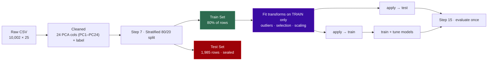

# Voice PCA Pipeline — Flow & Step-by-Step Guide

Flow for **`voice-pca-pipeline-guided.ipynb`** — screens voice (acoustic) features for mental
health profiles. It trains a **LightGBM** classifier reaching **99.50% test accuracy** across
**6 classes** (Anxiety, Bipolar, Depression, Normal, Stress, Suicidal) from **23** PCA components
(`PC1`–`PC24`, with `PC17` dropped).

> Mermaid note: line breaks inside nodes use ` ` so the diagram renders on GitHub and in
> the VS Code Markdown preview. (A literal backslash-n does not render and shows as raw text.)

The notebook runs **Step 0 – Step 17**. The numbering below matches the notebook's cell banners
exactly. Same anti-leakage design as the text pipeline; the input is already PCA-reduced, so
there is **no categorical encoding step**.

---

## 1. End-to-End Flow

```mermaid
flowchart TD
    S0["Step 0 · Imports & Hardware Detection<br/>libraries · CPU cores · GPU/CUDA"]
    S1["Step 1 · Configuration<br/>CONFIG dict · path · seed · OUTPUT_DIR"]
    S2["Step 2 · Data Loading<br/>read PCA CSV → DataFrame"]
    S3["Step 3 · Column Overview<br/>per-column summary"]
    S35["Step 3.5 · Manual Setup<br/>drop columns + TARGET = label"]
    S4["Step 4 · Data Profiling & Quality Audit<br/>nulls · duplicates · dtypes (diagnostic)"]
    S5["Step 5 · Target Validation<br/>confirm label · class balance (6 classes)"]
    S6["Step 6 · Auto-Clean<br/>drop duplicate rows / flagged cols"]

    SPLIT{{"Step 7 · Target Analysis & Stratified Train/Test Split<br/>stratified 80/20 · test = 1,985 rows<br/>ANTI-LEAKAGE BOUNDARY"}}

    subgraph FIT["Train-fit transforms — fit on TRAIN only, apply to both"]
        direction TB
        S8["Step 8 · Outlier Smoothing<br/>per-column lowest-skew transform · never drops rows"]
        S9["Step 9 · Loose Feature Selection<br/>MI + RF consensus · 24 → 23 (drop PC17)"]
        S10["Step 10 · Feature Scaling<br/>RobustScaler"]
        S8 --> S9 --> S10
    end

    subgraph MODEL["Model search & tuning — train only"]
        direction TB
        S11["Step 11 · Model Shortlisting<br/>hardware-aware (up to 8 models)"]
        S12["Step 12 · Cross-Validated Training & Ranking<br/>5-fold stratified · F1 macro"]
        S13["Step 13 · Top-K Model Selection<br/>keep top 2 by CV score"]
        S14["Step 14 · Hyperparameter Tuning<br/>Optuna TPE · 5-fold CV per trial"]
        S11 --> S12 --> S13 --> S14
    end

    subgraph DELIVER["Evaluate & deliver"]
        direction TB
        S15["Step 15 · Final Evaluation on Test<br/>Accuracy 99.50% · F1 0.9950<br/>raw + normalized confusion matrix"]
        S16["Step 16 · Save All Artifacts<br/>model · scaler · encoder · transformers · feature_names · metadata"]
        S17["Step 17 · Explainability (SHAP)<br/>global · per-class · waterfall PNGs"]
        S15 --> S16 --> S17
    end

    S0 --> S1 --> S2 --> S3 --> S35 --> S4 --> S5 --> S6 --> SPLIT
    SPLIT -->|"Train 80% of rows"| FIT
    FIT --> MODEL --> DELIVER
    SPLIT -.->|"Test 1,985 rows held out"| S15

    style SPLIT fill:#533483,stroke:#e94560,color:#fff
    style FIT fill:#0f3460,stroke:#53a8b6,color:#fff
    style MODEL fill:#6a040f,stroke:#d00000,color:#fff
    style DELIVER fill:#2d6a4f,stroke:#40916c,color:#fff
```

---

## 2. Anti-Leakage Design (why the split is the boundary)

The input is already PCA-reduced acoustic features, so there is **no categorical encoding step**.
Everything that learns from data (outlier parameters, the selected component list, the scaler) is
fit **only on the training set** and applied unchanged to the sealed test set, which is touched
once at Step 15.

---

## Step-by-Step — What Happens & Why

### Step 0 — Imports & Hardware Detection
**What:** Imports every library used in the run and detects CPU core count and GPU/CUDA
availability.
**Why:** Importing up front makes the notebook fail fast if a dependency is missing. Detecting
hardware lets later steps switch LightGBM/XGBoost to GPU automatically.

### Step 1 — Configuration
**What:** Builds the `CONFIG` dictionary — dataset path, random seed, output directory.
**Why:** A single config block controls the run and makes the split, training, and tuning
reproducible across runs.

### Step 2 — Data Loading
**What:** Reads the PCA-feature CSV into a DataFrame and prints shape/dtypes/head.
**Why:** Confirms the expected `PC1`–`PC24` + `label` layout arrived intact before any
processing.

### Step 3 — Column Overview
**What:** Prints a per-column summary (dtype, nulls, unique count, sample value).
**Why:** Gives a quick, concrete view of what's in the data before any decisions are made.

### Step 3.5 — Manual Setup (drop columns + target)
**What:** Lets you drop any unwanted columns and sets `TARGET_COLUMN = 'label'`.
**Why:** One explicit place to exclude non-features and pin the prediction target, so all
downstream steps agree on what's a feature and what's the label.

### Step 4 — Data Profiling & Quality Audit
**What:** Scans columns for nulls, duplicates, and dtype issues. Diagnostic only.
**Why:** Cleaning should be evidence-driven — this separates "diagnose" from the "fix" in Step 6.

### Step 5 — Target Validation
**What:** Confirms the target column is valid and analyzes class balance (6 classes).
**Why:** Verifies the label is usable and near-balanced, so no resampling/weighting is needed and
later per-class metrics are fair.

### Step 6 — Auto-Clean
**What:** Removes duplicate rows and any columns flagged in profiling.
**Why:** Duplicates bias both training and evaluation; removing them keeps the dataset honest
before the split.

### Step 7 — Target Analysis & Stratified Train/Test Split (CRITICAL)
**What:** Analyzes class distribution, then performs the **stratified 80/20** split; the test set
(1,985 rows) is sealed here.
**Why:** This is the **anti-leakage boundary** — splitting before any fitting guarantees the test
set is free of training-derived statistics. Stratification preserves class proportions in both
sets.

### Step 8 — Outlier Smoothing (train-fit)
**What:** Per PCA column, detects outliers on the training set and applies the lowest-skew
smoothing transform (winsorize / log1p / sqrt / Yeo-Johnson). Fit on train, applied to both.
**Why:** Smoothing rather than dropping rows preserves every sample; fitting on train only keeps
the test set leakage-free.

### Step 9 — Loose Feature Selection (train-fit)
**What:** Consensus of mutual information and random-forest importance; drops a component only if
it ranks lowest by **both**. Result: **24 → 23** (drops `PC17`). ("Loose" = deliberately
conservative.)
**Why:** Requiring two metrics to agree avoids discarding a useful component on a single noisy
estimate, while still removing the one that carries essentially no signal.

### Step 10 — Feature Scaling (train-fit)
**What:** `RobustScaler`, fit on train and applied to both.
**Why:** Centers on the median and scales by IQR so residual outliers don't dominate, giving all
candidate models a fair, consistently scaled input.

### Step 11 — Model Shortlisting
**What:** Selects which of up to 8 candidate models to train, given data shape and hardware.
**Why:** Skips models ill-suited to the data/hardware so the search stays efficient.

### Step 12 — Cross-Validated Training & Ranking
**What:** 5-fold stratified CV on every shortlisted model, scored by **F1 macro**.
**Why:** CV gives a stable generalization estimate; F1 macro weights all 6 classes equally so no
class is hidden behind the others.

### Step 13 — Top-K Model Selection
**What:** Keeps the top 2 models by CV score for tuning.
**Why:** Concentrates the (expensive) tuning budget on the strongest candidates.

### Step 14 — Hyperparameter Tuning (Optuna TPE)
**What:** Tunes the top 2 with Optuna's TPE sampler, 5-fold CV per trial.
**Why:** Bayesian (TPE) search learns from earlier trials to focus on promising hyperparameters —
more sample-efficient than grid/random search. **LightGBM wins after tuning.**

### Step 15 — Final Evaluation on Test Set
**What:** Scores the tuned best model on the sealed test set (first and only scoring use) and
builds the raw + normalized confusion matrix and per-class report.
**Why:** A single untouched evaluation is the honest performance measure.
**Result: LightGBM, 99.50% accuracy, F1 0.9950** (runner-up Extra Trees, F1 0.9925).

### Step 16 — Save All Artifacts
**What:** Saves model, scaler, label encoder, outlier transformers, feature names, and metadata
to a timestamped folder (`{Model}_{dd-Mon-yyyy}_{HH-MM-SS}/`).
**Why:** Inference must reuse the exact transforms and component order from training; bundling
them makes the run reproducible and deployable. See `demo-api-input-data-sample/` for example
inputs.

### Step 17 — Model Explainability (SHAP)
**What:** Computes SHAP values on the test set; saves global importance, per-class, and waterfall
plots.
**Why:** Explains *why* each prediction was made — which acoustic components push a sample toward
a given class — so results can be reviewed and trusted rather than taken on faith.
